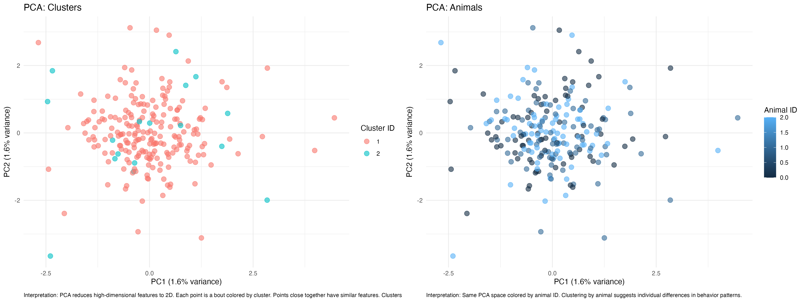
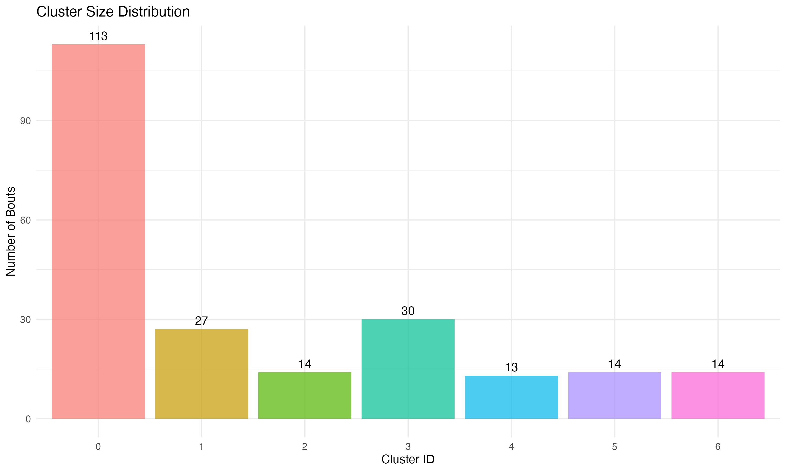
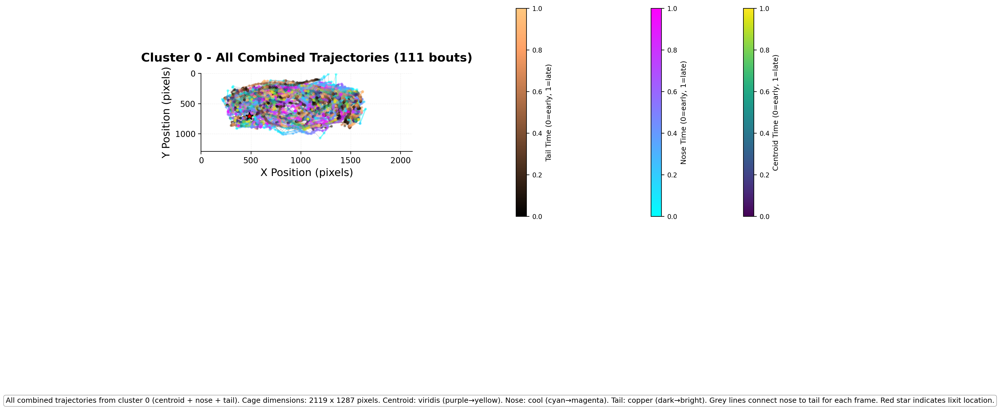
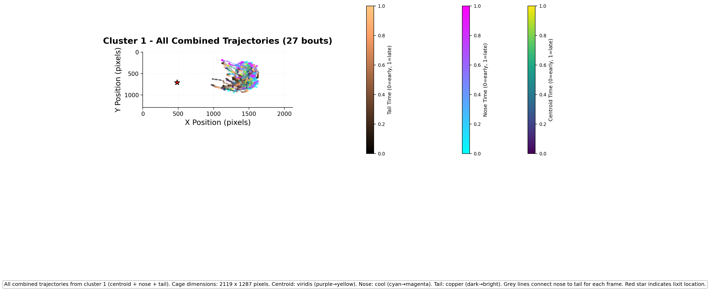

# JABS Behavior Clipper

Complete analysis pipeline for behavior bout clustering and outlier detection.

## Example Results

### Clustering Visualizations

| B-SOID t-SNE Clusters | Hierarchical PCA Clusters |
|:---------------------:|:-------------------------:|
|  |  |

### Cluster Size Distribution



### Trajectory Analysis

Combined trajectories showing bounding box centroid (viridis), nose keypoint (cool), and tail keypoint (copper):

| Cluster 0 Trajectories | Cluster 1 Trajectories |
|:----------------------:|:----------------------:|
|  |  |

*Red star indicates lixit (water spout) location. Grey lines connect nose to tail for body orientation.*

---

## Quick Start

Run the complete analysis pipeline:

```bash
cd JABSbehvaviorClipper
python3 run_complete_analysis.py --behavior turn_left
```

This will:
1. Extract features from HDF5 files
2. Create video of all bouts
3. Detect outliers (multiple methods + consensus)
4. Create video of outliers
5. Apply PCA (95% variance) and cluster with hierarchical and B-SOID methods
6. Generate PDF reports and cluster videos
7. Generate trajectory plots for each cluster

## Main Scripts

### Pipeline Scripts
- **`run_complete_analysis.py`** - Complete pipeline (recommended)
  - Order: Extract features → All bouts video → Outlier detection → Outlier video → PCA → Clustering → PDFs & videos
- **`run_analysis_pipeline.py`** - Unified pipeline (alternative)

### Core Scripts
- **`scripts/extract_bout_features.py`** - Extract bout features from HDF5 files (with caching & parallel processing)
- **`scripts/generate_bouts_video.py`** - Generate behavior bout videos with bounding boxes
- **`scripts/plot_bout_trajectories.py`** - Generate trajectory plots for clustered bouts
- **`scripts/check_h5_structure.py`** - Check HDF5 file structure (utility)

## Directory Structure

```
JABSbehvaviorClipper/
├── run_complete_analysis.py      # Main pipeline script
├── run_analysis_pipeline.py      # Alternative pipeline
├── scripts/                      # Python scripts
│   ├── extract_bout_features.py
│   ├── generate_bouts_video.py
│   ├── plot_bout_trajectories.py
│   └── check_h5_structure.py
├── BoutAnalysisScripts/          # R analysis scripts
│   ├── scripts/
│   │   ├── core/                 # Core analysis
│   │   ├── visualization/        # Visualization
│   │   └── video/                # Video generation
│   ├── docs/                     # Documentation
│   ├── utils/                    # Utility functions
│   ├── config/                   # Configuration
│   └── setup/                    # Setup scripts
├── docs/                         # Project documentation
│   ├── examples/                 # Example output images
│   ├── user-guides/              # User guides
│   ├── technical/                # Technical docs
│   └── documentation_registry.yaml
├── BoutResults/                  # Output directory (created when running)
│   ├── bout_features.csv
│   ├── videos/
│   ├── outliers/
│   └── clustering/
└── README.md                     # This file
```

## Usage

### Complete Pipeline (Recommended)

```bash
cd JABSbehvaviorClipper
python3 run_complete_analysis.py --behavior turn_left
```

### Individual Steps

```bash
# Extract features
python3 scripts/extract_bout_features.py --behavior turn_left

# Generate video of all bouts
python3 scripts/generate_bouts_video.py --behavior turn_left

# Cluster bouts
Rscript BoutAnalysisScripts/scripts/core/cluster_bouts.R \
  --input BoutResults/bout_features.csv \
  --method hierarchical

# Detect outliers
Rscript BoutAnalysisScripts/scripts/core/detect_outliers_consensus.R \
  --features BoutResults/bout_features.csv

# Generate trajectory plots
python3 scripts/plot_bout_trajectories.py --behavior turn_left --output-dir BoutResults --video-dir ..
```

## Output

All output is organized in `BoutResults/` directory:
- `BoutResults/bout_features.csv` - Feature matrix
- `BoutResults/videos/all_bouts.mp4` - Video of all bouts
- `BoutResults/videos/outliers.mp4` - Video of outliers
- `BoutResults/videos/hierarchical/` - Cluster videos for hierarchical
- `BoutResults/videos/bsoid/` - Cluster videos for B-SOID
- `BoutResults/outliers/consensus_outliers.csv` - Consensus outliers
- `BoutResults/clustering/*/clustering_*_report.pdf` - PDF reports
- `BoutResults/clustering/*/trajectories/` - Trajectory plots

## Key Features

- ✅ Uses `unfragmented_labels` to match GUI counts
- ✅ Only processes `present=True` bouts
- ✅ Multi-method outlier detection with consensus voting
- ✅ PCA dimensionality reduction (95% variance)
- ✅ Multiple clustering methods (Hierarchical, B-SOID)
- ✅ PDF reports for each clustering method
- ✅ Cluster videos for visualization
- ✅ **Trajectory plots** showing centroid, nose, and tail movements
- ✅ Parallel processing (n-1 cores) throughout
- ✅ Caching to avoid recomputation

## Requirements

- Python 3 with: pandas, numpy, h5py, matplotlib
- R with packages: optparse, dplyr, jsonlite, ggplot2, Rtsne, factoextra, pheatmap, cluster, parallel, MASS, dbscan
- ffmpeg (for video generation)
- h5dump (for bounding box extraction)

Install R packages:
```bash
Rscript BoutAnalysisScripts/setup/install_packages.R
```

## Path Configuration

Scripts assume data is in the parent directory:
- Annotations: `../jabs/annotations/`
- Features: `../jabs/features/`
- Videos: `../` (parent directory)

You can override these with command-line arguments:
```bash
python3 run_complete_analysis.py \
    --behavior turn_left \
    --annotations-dir /path/to/annotations \
    --features-dir /path/to/features \
    --video-dir /path/to/videos
```

## Documentation

For complete documentation, see the [Documentation Registry](docs/documentation_registry.yaml) for a machine-readable index of all documentation.

### Quick Links

- **`docs/user-guides/QUICK_START.md`** - Quick start guide
- **`docs/user-guides/ANALYSIS_PIPELINE.md`** - Complete pipeline documentation
- **`docs/user-guides/PERFORMANCE.md`** - Performance optimization guide
- **`BoutAnalysisScripts/README.md`** - Analysis scripts overview
- **`BoutAnalysisScripts/docs/TRAJECTORY_PLOTTING.md`** - Trajectory plotting guide
- **`docs/documentation_registry.yaml`** - Machine-readable documentation index

### Documentation Categories

- **User Guides**: Quick start, usage guides, troubleshooting
- **Technical**: Statistical methodology, distance metrics, implementation details
- **API Reference**: Script documentation, parameter references

## Notes

- All scripts use `unfragmented_labels` from annotation JSON files
- Only `present=True` bouts are included in feature extraction
- Output is organized in `BoutResults/` directory for cleanliness
- Cache is automatically invalidated when annotation files change
- **HDF5 Note**: Keypoints and lixit locations are stored as `[y, x]` in HDF5 files; the scripts automatically convert to `(x, y)` for plotting
